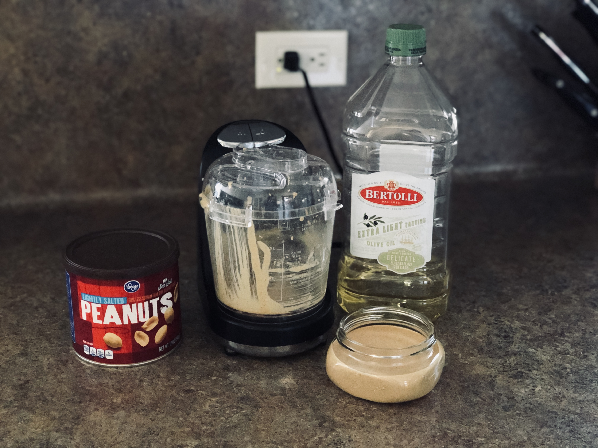

# peanut butter

Peanut butter has long been a staple of my diet, and it is very easy to make. Whether used on roasted poblano and peanut butter sandwiches, as a dip for vegetables or as an ingredient in a complex dish, it can be a delicious snack or a main course. I do tinker quite a bit with this recipe. For the holidays, a little bit of cinnamon and clove adds a nice touch. Peanut butter can always be sweetened with honey, and I like to add some cocoa for movie night PB and veggies.

### Gear

You will need a food processor, spatula, and a Mason jar or other sealable container for your PB.

### Ingredients

  * 2 cups of peanuts (whatever you fancy)
  * 1 small pinch of salt
  * 1 tablespoon of olive oil (_optional_ - yields a creamier PB for breads)
  * 1 tablespoon honey (_optional_ - yields a sweeter PB)
  * 1 tablespoon cocoa powder (or some chocolate chips) for the chocolate variety
  * 1/2 teaspoon cinnamon and a pinch of clove for the holiday variety

### Instructions

If you would like to roast them, do that first. Do that by heating your oven to 350 degrees (F) and watch for the color to change to a glossy light brown. Should take around 10 minutes.

Put the peanuts into the food processor, and pulse for five minutes (use the spatula to scrape down the sides as needed), then add the _optional_ oil, honey, cocoa powder, cinnamon/clove, and pulse for another three minutes. Taste the mix, and alter the ingredients until you are happy with it. I do not like really salty peanut butter, but have friends that do---tinker freely, and make it your own. If you like chunky peanut butter, add 1/4 cup of peanuts, and pulse the processor for just a moment until the desired consistency is achieved.

Transfer your PB to the sealable container, and dig in.
