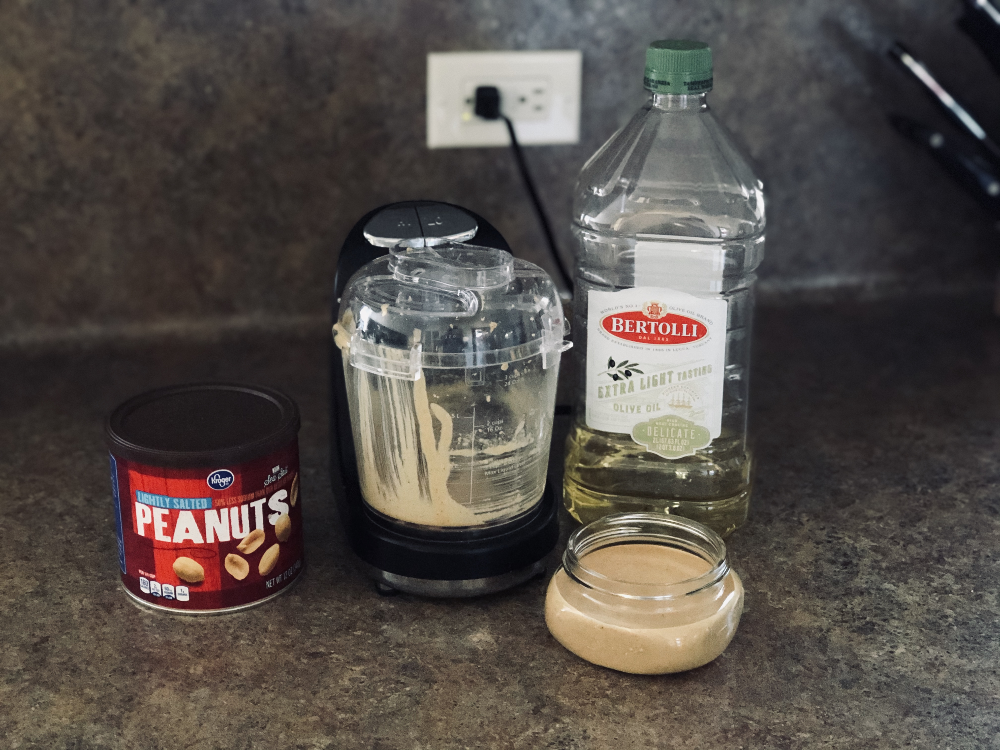

# Condiments

## Peanut Butter

Peanut butter has long been a staple of my diet, and it is very easy to make. Whether used on roasted poblano and peanut butter sandwiches, as a dip for vegetables, or as an ingredient in a complex dish, it can be a delicious snack or a main course on a long bike ride. I do tinker quite a bit with this recipe. For the holidays, a little bit of cinnamon and clove adds a nice touch. Peanut butter can always be sweetened with honey, and some folks I know and live with also enjoy the addition of cocoa.

### Gear

You will need a food processor, spatula, and a sealable container for your PB.

### Ingredients

  * 2 cups of peanuts (whatever your fancy)
  * 1 small pinch of salt
  * 1 tablespoon of olive oil (_optional_ - yields a creamier PB for breads)
  * 1 tablespoon honey (_optional_ - yields a sweeter PB)
  * 1 tablespoon cocoa powder (or some chocolate chips) for the chocolate variety
  * 1/2 teaspoon cinnamon and a pinch of clove for the holiday variety

### Instructions

If you would like to roast the peanuts, do that first. Heat your oven to 350 degrees (F), and watch for the color to change to a glossy light brown. This should take around 10 minutes.

Place the peanuts into the food processor, and pulse for five minutes (use the spatula to scrape down the sides as needed), then add the _optional_ oil, honey, cocoa powder, cinnamon/clove, and pulse for another three minutes until silky. Taste the mix, and alter the ingredients until you are happy with it. Tinker freely, and make it your own. If you prefer chunky peanut butter, add 1/4 cup of peanuts, and pulse the processor for just a moment until the desired consistency is achieved.

Transfer your PB to the sealable container, and dig in.

## Pesto

You will need a food processor, spatula, and a sealable container for your pesto.

### Ingredients

* 2 cups _fresh_ basil leaves (home grown = best)
* 4 cloves of garlic (more or less to taste)
* 3/4 cup extra-virgin olive oil
* 1/2 cup grated parmesan cheese (buy the block and grate it yourself)

### Instructions

Place the basil leaves and garlic into the food processor and pulse until finely minced. Add the olive oil, and continue pulsing until the mixture reaches a smooth consistency. The parmesan is added last, and just a few final pulses should put you over the line.

Transfer your pesto to the sealable container, or to a fresh dish.
